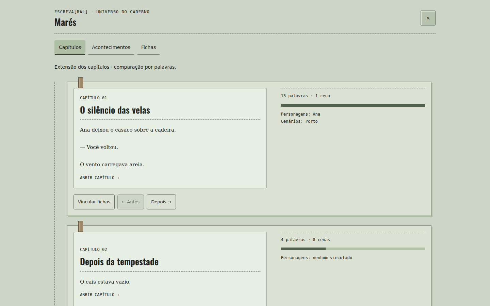
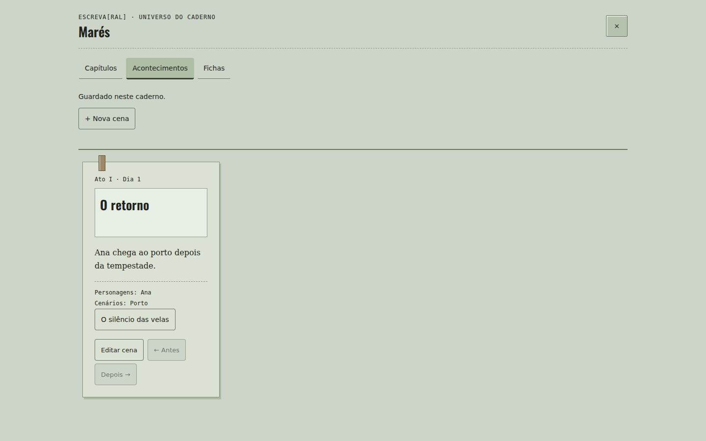
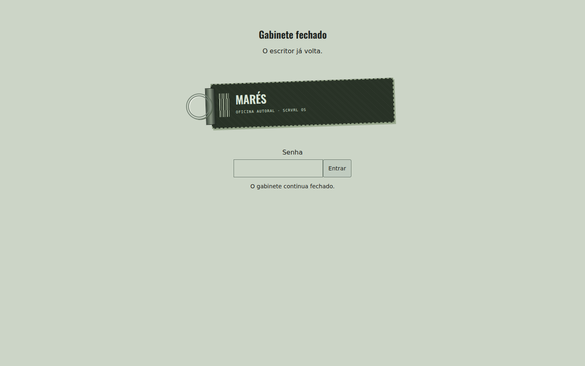
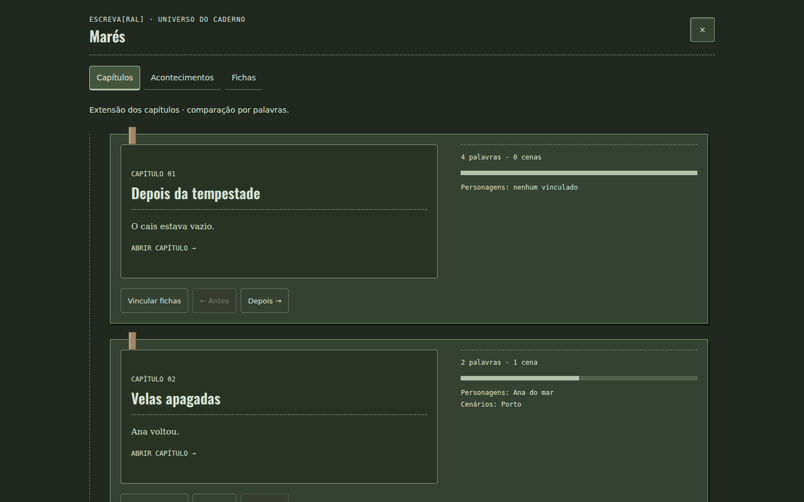
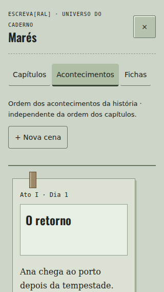

# Auditoria e acabamento da v6

Base verificada: `main` em `47f2892edcbdc1dc135e8a2eca27d761e4872084`, meta `20260913-scrvrl-cadernos-v5`. Branch de trabalho: `feat/encore-acabamento-v6`. A tarefa antiga foi abandonada; este trabalho parte da main confirmada pelo GitHub.

O usuário aprovou a auditoria seguida da implementação do acabamento, cadeado e universo por caderno. O documento de planejamento de 14/09/2026 e as respostas seguintes definem o escopo. Não há autorização de publicação em produção nesta etapa.

## Auditoria reproduzida

A revisão do HTML da main e sua execução em Chromium confirmaram os seguintes problemas:

- Calculadora: 42 teclas, com um conjunto estático seguido de outro criado pelo JavaScript. Corrigida a montagem para produzir 21 controles funcionais, com nomes acessíveis para operadores.
- Busca do editor: sobreposição com os controles em desktop e celular. Antes, em 1440 px, o campo terminava em x=1073 e os controles começavam em x=1053; em 320 px, o campo terminava em x=152 e os controles começavam em x=74. A ausência de transbordamento horizontal não detectava essas colisões.
- Toggle: borda real #7c8b78 e fundo #b3c2b1; o controle marcado usava #9fad9b. A evidência anterior calculava sobre outro fundo. Novo limite visual #4a544c no claro, com diferenciação do estado e tratamento correspondente no escuro.
- Alvos de Início, breadcrumb, controles da janela, minimizar e tamanho da fonte: ampliados para 44 px. A altura útil da escrita agora considera as medidas reais das barras superior/inferior.
- Acesso móvel à mesa: botão do rodapé explicitamente disponível, além do Início. A busca ocupa linha própria; os comandos ficam abaixo em telas estreitas.
- Consulta de folhas: indicação permanente “Abrir”, sem depender de hover. O título da folha ativa continua visível.
- Movimento reduzido: cobre os efeitos da interface; novos componentes usam estados estáticos, sem física ou animação contínua.
- JavaScript: mensagem sem script agora explicita a dependência, sem prometer escrita numa tela que permanece oculta.

Não aplicar automaticamente as sugestões antigas de reduzir a janela e remover o espaço do editor. A tela vazia de cadernos não comprova defeito de densidade de “Seus textos”; o espaço do editor participa da centralização da escrita. O print “folha-escuro” mostra um formulário de caderno, não o editor. Captura estreita não comprova Safari antigo.

Correspondência ao índice: 01 contraste; 03 alvos; 04 acesso móvel; 07 ações visíveis; 08 rótulos; 09 movimento; 10 dependência de JS; 11 testes de integridade. O item 02 é regra de rótulos, sem botão vazio confirmado. Itens 05 e 06 exigem contextualizar a evidência. A calculadora não tinha plano próprio. Quadro de giz (12/12b) não integra os quatro protótipos aprovados para esta implementação.

## Novos conteúdos

- Família de teclas com bordas em relevo para Início, cadeado e controles estratégicos. Navegação comum preserva peso discreto.
- Etiqueta de tecido com a marca nas capas dos cadernos.
- Cortina de bloqueio com chaveiro tarja, campo cenográfico e abertura pela argola. Senha nenhuma funciona. O valor digitado não é persistido. O bloqueio volta após recarregar na mesma sessão, retém o contexto da escrita, bloqueia os atalhos do aplicativo e permite operar a argola por teclado. Não é autenticação nem criptografia.
- Entrada “Universo do caderno” no Início e “Capítulos e universo” no caderno aberto.
- Capítulos: polaroides com título real, prévia, palavras, extensão relativa, personagens, cenários e quantidade de cenas. Abrir chama o editor existente. Ordem explícita do mapa visual de capítulos.
- Acontecimentos: cenas em sequência narrativa própria, com marcador temporal opcional. A ordem independe de datas de edição e da ordem dos capítulos.
- Fichas curtas de personagens e cenários; vínculos selecionáveis em cenas ou diretamente no capítulo. Renomear a ficha mantém vínculos; excluir pede confirmação e remove referências, preservando o manuscrito.
- Todos os registros pertencem ao caderno. Formulários ficam disponíveis em caso de erro de gravação. Mudanças concorrentes detectadas na coleção de fichas não são sobrescritas silenciosamente.

## Dados e compatibilidade

`notebook.data.story` contém versão, personagens, cenários, cenas e vínculos/ordem dos capítulos. O pacote `.scrvrl` existente continua em JSON UTF-8 legível, preservando os demais dados do caderno. A importação valida o formato e remapeia as referências de capítulos ao criar uma cópia. Vínculos usam `noteId`, não o título nem o identificador de cada revisão.

Cenas cujo capítulo foi apagado ou movido conservam seus próprios dados e mostram “Capítulo indisponível neste caderno”; podem ser vinculadas novamente. Não há detecção automática de personagem por ocorrência do nome no texto.

Nenhuma dependência adicionada ao aplicativo. Scripts da página continuam ES5. Contagens já obtidas são reaproveitadas enquanto os registros não mudarem; somente uma consulta principal fica montada, com até 12 cartões por página. O texto completo não é duplicado nas polaroides. Os efeitos são CSS e elementos estáticos. Service worker recebe a meta/cache da v6; seu código moderno preexistente permanece restrito aos navegadores que o suportam.

## Verificação

Passaram:

- `node tests/cadernos.cjs`: migração, integridade do pacote, exportação/importação, cópias, falhas de gravação, rollback e lixeira.
- `node tests/universo.cjs`: fichas, vínculos, isolamento entre cadernos, dados anteriores preservados, remapeamento na cópia e rejeição de referências inválidas.
- `tests/cadernos-browser.cjs`: fluxos anteriores e recarga offline com service worker da v6.
- `tests/universo-browser.cjs`: criação, edição, ordem, palavras, cenas, vínculos, erro de quota, bloqueio e recarga, desbloqueio por teclado/toque, pacote real e importação de cópia, isolamento, claro/escuro.
- Análise sintática dos 30 scripts inline com Acorn em `ecmaVersion:5`.
- Revisão de capturas em 1440×900, 820×1180, 390×844, 320×568 e 667×375. Sem transbordamento horizontal da página ou da nova tela; o varal possui rolagem horizontal própria intencional.

A busca agora termina em x=1014 no desktop de 1440 px, antes dos controles em x=1041. Em 320 px, ocupa uma linha de 296×44 px; os comandos ficam na linha seguinte. Calculadora: 21 teclas após a inicialização.

Comandos de navegador: definir `NODE_PATH` para o Playwright instalado na máquina de QA e `CHROMIUM_PATH` para o executável. O teste do universo aceita `QA_OUTPUT` para as capturas. Dependências de teste não são distribuídas com o aplicativo.

Limites: testes executados em Chromium 153. Não houve Safari/iOS 9 físico, Android KitKat ou teclado virtual real; mudança de viewport não comprova comportamento desses sistemas. Não afirmar compatibilidade universal nem homologação completa no iPad. A comparação com a v5 usa o código confirmado da main servido localmente, não uma nova homologação da URL de produção.

## Capturas para revisão

As imagens usam dados fictícios criados pelos testes.

